# ML1

- [Метод опорных методов](#Метод-опорных-методов)
- [Метод главных компонент](#Метод-главных-компонент)
- [Нелинейные методы восстановления регрессии](#Нелинейные-методы-восстановления-регрессии)
- [Композиция алгоритмов](#Композиция-алгоритмов)

# Композиция алгоритмов

При решении сложных задач классификации, регрессии, прогнозирования часто
оказывается, что ни один из алгоритмов не обеспечивает желаемого качества
восстановления зависимости. В таких случаях имеет смысл строить композиции алгоритмов,
в которых ошибки отдельных алгоритмов взаимно компенсируются. Наиболее
известные примеры композиций — простое и взвешенное голосование.

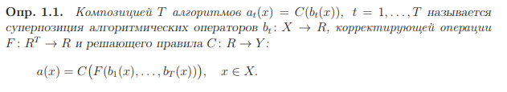

Пространство оценок R вводится для того, чтобы расширить множество допустимых
корректирующих операций

#### Примеры пространств оценок

В задачах классификации на два класса, Y = {−1, +1}, в качестве
пространства оценок обычно используется множество действительных чисел R = R.
В этом случае алгоритмические операторы называют также вещественнозначными
классификаторами (real-valued classifiers):

**C(b(x)) = sign b(x)**

Классификация на M классов Y = {1,...,M}:

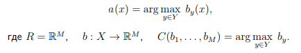

Регрессия, Y = R = R Решающие правило не нужно.

#### Примеры корректирующих операций
Простое голосование:

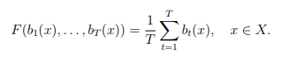

Взвешенное голосование:

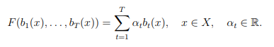

Смесь алгоритмов:

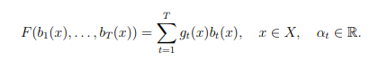

## Бустинг

Рассмотрим задачу классификации на два класса Y = {1;+1}.
Решающее правило имеет вид C(b) = sign(b).
Базовые алгоритмы возвращают ответы {1;0; +1}, 
Если алгоритм возвращает 0 — означает отказ от классификации объекта и ответ не учитывается в композиции.
Искомая алгоритмическая композиция имеет вид:

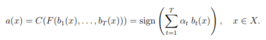

Функционал качества композиции — число ошибок на обучающей
выборке:

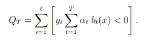

Принимаются следующие две эвристики:
1. При добавлении в композицию нового слагаемого, оптимизируется только новые слагаемые, а все предыдущие слагаемые полагаются фиксированными.
2. Пороговая функция потерь в функционале Qt аппроксимируется гладкой оценкой сверху

### Гладкие верхние аппроксимации пороговой функции потерь

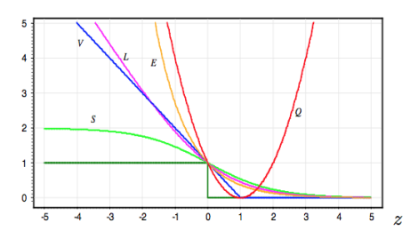

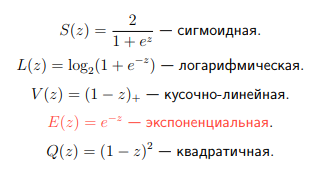

### AdaBoost

Используя экспоненциальную аппроксимацию получим широко известный метод AdaBoost

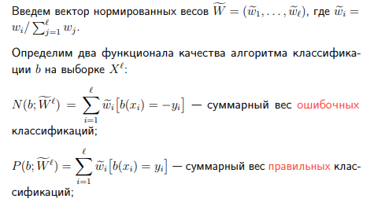

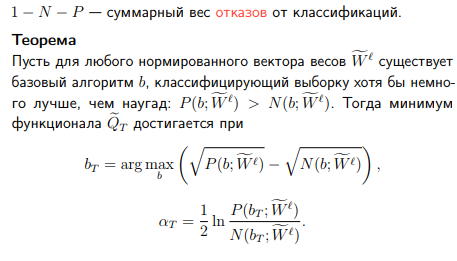

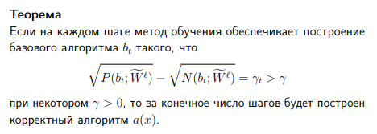

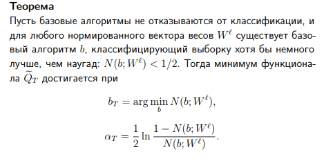

### Алгоритм AdaBoost 

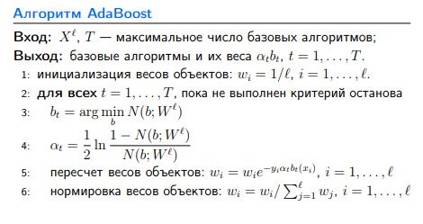

Фильтрация выбросов. Через некоторое количество итераций
удалить небольшую группу (пары десятков) объектов с наибольшими
весами.
Обобщающая способность бустинга. В течение последних
10 лет бустинг остаётся одним из наиболее популярных методов
машинного обучения, наряду с нейронными сетями и машинами
опорных векторов. Основные причины — простота, универсальность,
гибкость (возможность построения различных модификаций),
и, главное, неожиданно высокая обобщающая способность.
Бустинг над решающими деревьями считается одним из наиболее
эффективных методов с точки зрения качества классификации.

#### Преимущества
- Хорошая обобщающая способность.
- Простота реализации.
- Небольшая вычислительная сложность. 
- Возможность находить выбросы. Э

#### Недостатки
- AdaBoost склонен к переобучению при наличии значительного
уровня шума в данных. 
- AdaBoost требует достаточно длинных обучающих выборок.
- Жадная стратегия последовательного добавления приводит
к построению неоптимального набора базовых алгоритмов.
- Бустинг может приводить к построению громоздких композиций,
состоящих из сотен алгоритмов

### AnyBoost

Обобщим алгоритм AdaBoost на случай произвольных мажоранты
функции потерь и базовых алгоритмов bt (которые необязательно
должны возвращать ±1). Рассмотрим взвешенное голосование: 

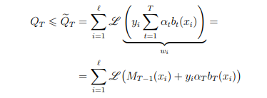

Рассмотрим функцию потерь

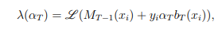

Разложим её в ряд Тейлора

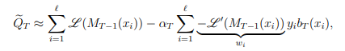

Если параметр фиксирован, то для минимизации функционала качества необходимо
строить базовый алгоритм , исходя из принципа явной максимизации отступов (DOOM):

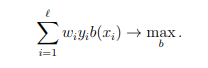

### Алгоритм AnyBoost

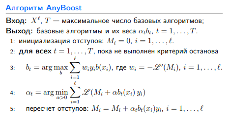

# Логические алгоритмы классификаци

Пусть **ϕ: X → {0, 1}** — некоторый предикат, определённый на множестве объектов
X. Говорят, что предикат **ϕ** выделяет или покрывает (cover) объект **x**, если
**ϕ(x) = 1**. 

Предикат называют **закономерностью**, если он выделяет достаточно много
объектов какого-то одного класса **c**, и практически не выделяет объекты других
классов (более строгое определение будет дано ниже).
Особую ценность представляют закономерности, которые описываются простой
логической формулой. Их называют **правилами (rules)**. Процесс поиска правил по выборке
называют **извлечением знаний из данных (knowledge discovery)**. К знаниям
предъявляется особое требование — они должны быть интерпретируемы, то есть
понятны людям. На практике логические закономерности часто ищут в виде конъюнкций
небольшого числа элементарных высказываний. Именно в такой форме люди
привыкли выражать свой житейский и профессиональный опыт.

### Пример
Решается вопрос о целесообразности хирургической
операции. Закономерность: если возраст пациента выше 60 лет и ранее он
перенёс инфаркт, то операцию не делать — риск отрицательного исхода велик.

## Понятие информативности

### Эвристическое определение информативности

Интуитивно предикат **ϕ** тем более информативен, чем больше он выделяет объектов
«своего» класса **c ∈ Y** по сравнению с объектами всех остальных «чужих»
классов. Свои объекты называют также **позитивными (positive)**, а чужие — **негативными
(negative)**. 

Введём следующие обозначения:
**Pc** — число объектов класса c в выборке **Xℓ**;
**pc(ϕ)** — из них число объектов, для которых выполняется условие **ϕ(x) = 1**;
**Nc** — число объектов всех остальных классов **Y \ {c}** в выборке **Xℓ**;
**nc(ϕ)** — из них число объектов, для которых выполняется условие **ϕ(x) = 1**.
Введём обозначение **Ec** для доли негативных среди всех выделяемых объектов,
и **Dc** для доли выделяемых позитивных объектов:

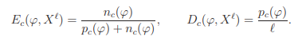

Предикат **ϕ(x)** будем называть **логической ε, δ-закономерностью** для
класса **c ∈ Y**, если **Ec(ϕ, Xℓ)<=ε** и **Dc(ϕ, Xℓ) >= δ** при заданных достаточно малом **ε**
и достаточно большом **δ** из отрезка **[0, 1]**.
Если **nc(ϕ) = 0**, то закономерность **ϕ** называется чистой или непротиворечивой.
Если **nc(ϕ) > 0**, то закономерность **ϕ** называется частичной

### Статистическое определение информативности

Пусть X — вероятностное пространство, выборка Xℓ — простая, то есть случайная,
независимая, одинаково распределённая (independent, identically distributed), y∗(x) и ϕ(x) — случайные величины. Допустим, справедлива гипотеза о независимости
событий {x: y∗(x) = c} и {x: ϕ(x) = 1}. Тогда вероятность реализации
пары (p, n) подчиняется гипергеометрическому распределению

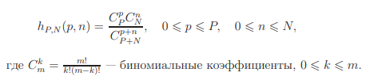

Информативность предиката **ϕ(x)** относительно класса **c ∈ Y** по выборке **Xℓ**

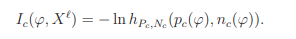

Предикат ϕ(x) будем называть статистической закономерностью для класса **c**, если
**Ic(ϕ, Xℓ) >= I0** при заданном достаточно большом **I0**.

При разумных сочетаниях параметров **ε** и **I0** эвристический критерий практически
всегда оказывается строже статистического. Имеется довольно
обширная область статистических закономерностей, для которых вероятность случайной
реализации крайне низка, в то же время, они допускают слишком много
ошибок и не являются логическими закономерностями в смысле **ε**, **δ**-критерия.

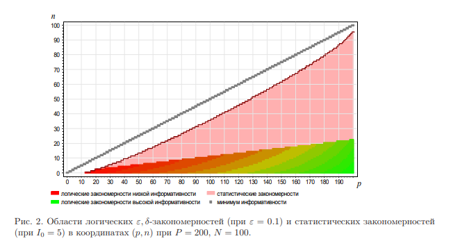

### Энтропийное определение информативности

Предикат **ϕ** является закономерностью по энтропийному критерию информативности,
если **IGainc(ϕ, Xℓ) > G0** при некотором достаточно большом **G0**.

Энтропийный критерий IGainc асимптотически эквивалентен статистическому Ic:

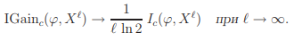

### Многоклассовая информативность

Статистический критерий обобщает статистическое определение информативности на случай произвольного числа классов **Y = {1, . . ., M}**:

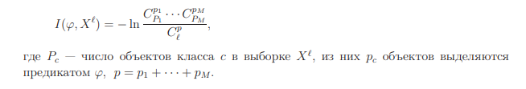

Энтропийный критерий для случая большого числа классов является асимптотическим приближением
статистического:

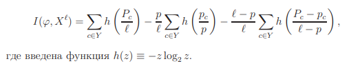

### Взвешенная информативность

Цена ошибки на разных объектах может быть различной. Например, она может
отличаться для разных классов: при выдаче кредитов «пропуск цели» (т. е. ненадёжного
заёмщика) обходится банку существенно дороже, чем «ложная тревога» (отказ
хорошему заёмщику). Обучающие объекты из класса «плохие заёмщики» должны
учитываться с большим весом при поиске логических закономерностей.

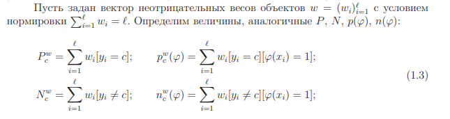

### Методы поиска информативных закономерностей

Бинаризация количественных признаков
Произвольный признак **f : X → Df** порождает семейство предикатов, проверяющих
попадание значения **f(x)** в определённые подмножества множества Df . Ниже
перечисляются наиболее типичные конструкции такого вида.

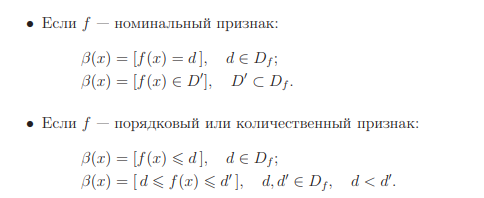

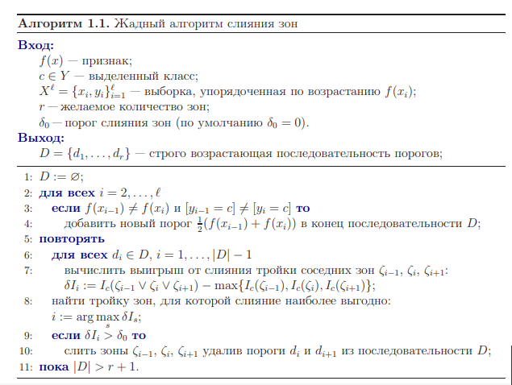

### Поиск закономерностей в форме конъюнкций

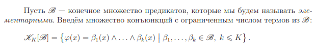

Число термов k в конъюнкции называется её рангом.

**Градиентный алгоритм*** синтеза конъюнкций. Поставим каждой конъюнкции
**ϕ** в соответствие её окрестность — множество конъюнкций **V (ϕ)**, получаемых
из **ϕ** путём элементарных модификаций: добавлением, изъятием или модификацией
одного из термов конъюнкции.
Начиная с заданной конъюнкции **ϕ0** (например, пустой), строится последовательность
конъюнкций **ϕ0, ϕ1, . . ., ϕt, . . .** , в которой каждая следующая конъюнкция
ϕt выбирается из окрестности предыдущей **Vt = V (ϕt−1)** по критерию максимума
информативности (шаг 3).

**Жадный алгоритм синтеза конъюнкции** использует только операцию добавления
термов. Начальным приближением является пустая конъюнкция (не содержащая
термов). Недостаток жадной стратегии в том, что она может уводить в сторону
от глобального максимума информативности. Терм, найденный на k-м шаге, перестаёт
быть оптимальным после добавления последующих термов. Тем не менее, в ряде
практических задач эта простая эвристика демонстрирует способность находить
неплохие закономерности.

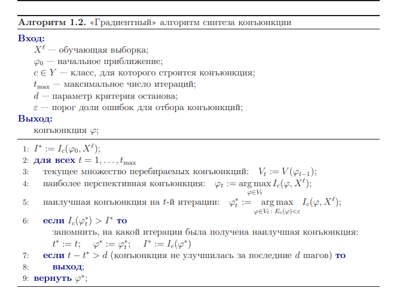

**Стохастический локальный поиск** (stochastic local search, SLS) также начинает
с пустой конъюнкции, но использует полный набор возможных модификаций. Это
преимущество по сравнению с жадным алгоритмом, так как появляется возможность
удалять и заменять неоптимальные термы. С другой стороны, мощность окрестности
**|V (ϕ)|** может оказаться настолько большой, что перебор всех допустимых модификаций
станет нерентабельным. Поэтому в SLS строится не вся окрестность, а только
некоторое её случайное подмножество. Максимальная допустимая мощность этого
подмножества задаётся как дополнительный параметр алгоритма **Vmax**.

Процедура стабилизации пытается улучшить конъюнкцию ϕ, удаляя или заменяя
по одному терму. В отличие от SLS, перебираются все возможные удаления и замены.
Модификации производятся до тех пор, пока возрастает информативность конъюнкции
Ic(ϕ, Xℓ
). Стабилизация повышает устойчивость алгоритма относительно малых
вариаций обучающей выборки или других условий обучения (например, генератора
псевдослучайной последовательности в SLS)

**Процедура редукции** отличается тем, что термы только удаляются, а информативность
вычисляется по независимой контрольной выборке Xk
, составленной из объектов,
не участвовавших в построении конъюнкции ϕ. Контрольную выборку формируют
до начала обучения, выделяя из массива исходных данных около 30% объектов,
как правило, случайным образом. При этом объекты разных классов распределяются
в той же пропорции, что и во всей выборке (этот принцип отбора называется стратификацией
выборки).

**Генетический алгоритм синтеза конъюнкций** (Genetic Algorithm, GA) можно
рассматривать как дальнейшее усовершенствование SLS на основе идей дарвиновской
эволюции. Главное отличие GA от SLS в том, что на каждом шаге отбирается
не одна наилучшая конъюнкция, а целое множество лучших конъюнкций, называемое
популяцией. Из них порождается большое количество конъюнкций-потомков
с помощью двух генетических операций — скрещивания и мутации. Скрещивание
(crossingover) — это образование новой конъюнкции путём обмена термами между
двумя членами популяции. В роли мутаций выступают уже знакомые операции добавления,
замещения и удаления термов. Таким способом можно получить огромное
количество потомков, но на практике строят лишь ограниченное число, не более T1
потомков путём случайных скрещиваний и мутаций. Затем производится естественный
отбор, в результате которого в следующее поколение переходят не более T0 наиболее
информативных потомков. Обычно берут T0 ≪ T1.

 В общем случае к форме
предъявляются два требования.

• Интерпретируемость. Условие **ϕ(x) = 1** должно выражаться на естественном
языке в форме, понятной эксперту. Для этого, в частности, закономерность ϕ(x)
должна зависеть от небольшого числа признаков **ω ⊆ {1, . . ., n}**. Обычно **|ω|**
ограничивают сверху числом от 2 до 7. Найденные сочетания признаков **ω** могут
либо подтверждать существующие представления о взаимосвязях между
признаками, либо указывать на существование ранее неизвестных взаимосвязей,
и тогда можно говорить о получении новых знаний из данных (knowledge
discovery). Некоторые из найденных сочетаний признаков ω могут оказаться
не интерпретируемыми с содержательной точки зрения; такие закономерности
отвергаются экспертами как «ложные».
• Эффективность поиска. Должны существовать эффективные методы поиска
закономерностей по конечной выборке U в рамках выбранного семейства предикатов
**Φ: I(ϕ, U) → max ϕ∈Φ**
. Как правило, наиболее трудоёмким является поиск
информативных наборов признаков **ω ⊆ {1, . . ., n}**.

**Решающий список** — это алгоритм классификации a: X → Y , который
задаётся набором закономерностей **ϕ1(x), . . ., ϕT (x)**, приписанных к классам
c1, . . ., cT ∈ Y соответственно, и вычисляется согласно Алгоритму 1.3.

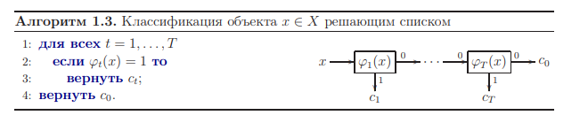

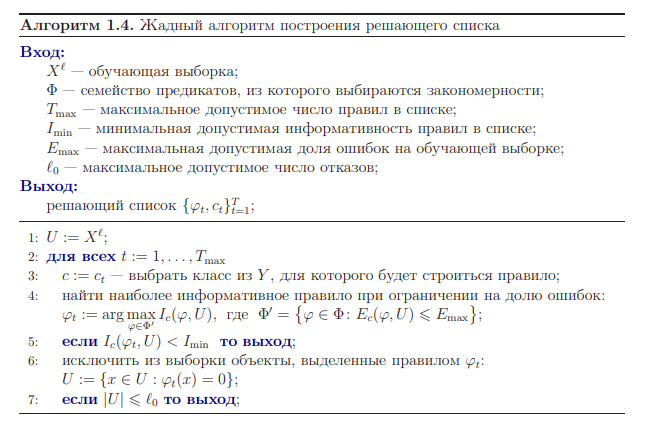

**Деревом** называется конечный связный граф с множеством вершин V , не содержащий циклов и имеющий выделенную вершину v0 ∈ V , в которую не входит ни одно ребро. Эта вершина называется корнем дерева. Вершина, не имеющая выходящих рёбер, называется терминальной или листом. Остальные вершины называются внутренними. Дерево называется бинарным, если из любой его внутренней вершины выходит ровно два ребра. Выходящие рёбра связывают каждую внутреннюю вершину v с левой дочерней вершиной Lv и с правой дочерней вершиной Rv.

**Бинарное решающее дерево** — это алгоритм классификации, задающийся бинарным деревом, в котором каждой внутренней вершине v ∈ V приписан предикат βv : X → {0, 1}, каждой терминальной вершине v ∈ V приписано имя класса cv ∈ Y . При классификации объекта x ∈ X он проходит по дереву путь от корня до некоторого листа, в соответствии с алгоритмом.

1: v := v0;

2: пока вершина v внутренняя

3: если βv(x) = 1 то

4: v := Rv; (переход вправо)

5: иначе

6: v := Lv; (переход влево)

7: вернуть cv.

Решающее дерево никогда не отказывается от классификации, в отличие от решающего списка. Отсюда также следует, что алгоритм классификации a: X → Y , реализуемый бинарным решающим деревом, можно представить в виде простого голосования конъюнкций.

# Метод опорных методов

D некоторых случаях более естественно использовать кусочно-линейную функцию **ε**-чувствительности, которая
не считает за ошибки отклонения **a(xi)** от **yi**, меньшие **ε**. Предполагается, что значение параметра **ε** задаёт эксперт, исходя из априорных соображений.

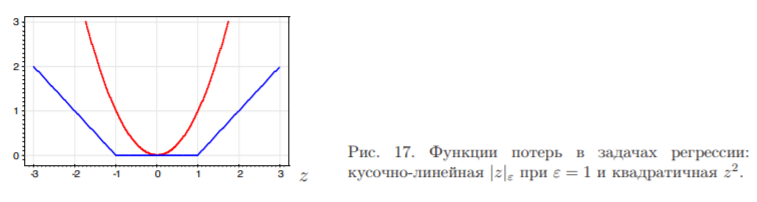

С этой функцией потерь функционал принимает вид

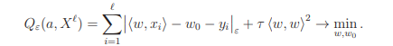

Легко обнаруживается сходство данной задачи с задачей классификации.
Покажем, что минимизация финкионала эквивалентна некоторой задаче квадратичного
программирования с линейными ограничениями типа неравенств. При этом также
возникает двойственная задача, зависящая только от двойственных переменных;
также достаточно оставить в выборке только опорные объекты; также решение
выражается через скалярные произведения объектов, а не сами объекты; и также
можно использовать ядра. Иными словами, SVM-регрессия отличается от SVM классификации
только в технических деталях, основные идеи остаются теми же. Положим **С=1/2r**. 

Введём дополнительные переменные 

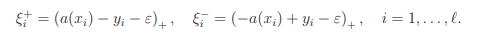

Тогда задача минимизации может быть переписана в эквивалентной форме
как задача квадратичного программирования с линейными ограничениями неравенствами

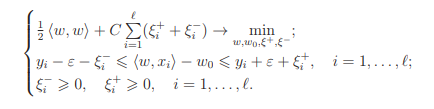

Как и в предыдущих случаях, лагранжиан этой задачи выражается через двойственные
переменные, а скалярные произведения можно заменить ядром.

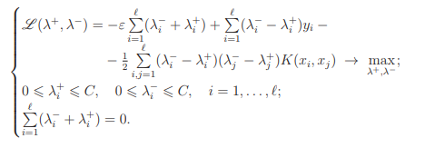

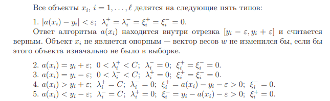

Объекты типов 2–5 являются опорными и учитываются при определении вектора
весов. При этом только на объектах типов 4 и 5 возникает ненулевая ошибка.

Уравнение регрессии также выражается через двойственные переменные:

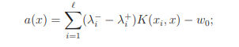

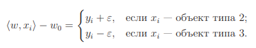

Как и раньше, чтобы избежать численной неустойчивости, имеет смысл взять медиану
множества значений **w0**, вычисленных по всем опорным векторам.
В этом методе есть два управляющих параметра. Параметр точности **ε** задаётся
из априорных соображений. Параметр регуляризации **C** подбирается, как правило,
по скользящему контролю, что является вычислительно трудоёмкой процедурой.

# Метод главных компонент

Ещё одно решение проблемы мультиколлинеарности заключается в том, чтобы подвергнуть исходные признаки некоторому функциональному преобразованию, гарантировав линейную независимость новых признаков, и, возможно, сократив их количество, то есть уменьшив размерность задачи.

В методе главных компонент (principal component analysis, PCA) строится минимальное число новых признаков, по которым исходные признаки восстанавливаются линейным преобразованием с минимальными погрешностями. PCA относится к методам обучения без учителя (unsupervised learning), поскольку матрица «объекты–признаки» _F_ преобразуется без учёта целевого вектора _y_.

**Постановка задачи.** Пусть имеется n числовых признаков %2C%20j%20%3D%201%2C%5Cdots%2Cn). Как обычно, будем отождествлять объекты обучающей выборки и их признаковые описания: %2C%5Cdots%2Cf_n(x_i))%2C%20i%20%3D%201%2C%5Cdots%2C%20%E2%84%93.) 

Рассмотрим матрицу F, строки которой соответствуют признаковым описаниям обучающих объектов: 

%26%5Cdots%26f_n(x_1)%5C%5C%5Cdots%26%5Cdots%26%5Cdots%5C%5Cf_1(x_l)%26%5Cdots%26f_n(x_l)%5Cend%7Bpmatrix%7D%20%3D%20%20%5Cbegin%7Bpmatrix%7Dx_%7B1%7D%5C%5C%5Cdots%5C%5Cx_%7Bl%7D%5Cend%7Bpmatrix%7D)

Обозначим через %2C%5Cdots%2Cg_m(x_i))) признаковые описания тех же объектов в новом пространстве  меньшей размерности, : 

%26%5Cdots%26g_m(x_1)%5C%5C%5Cdots%26%5Cdots%26%5Cdots%5C%5Cg_1(x_l)%26%5Cdots%26g_m(x_l)%5Cend%7Bpmatrix%7D%20%3D%20%20%5Cbegin%7Bpmatrix%7Dz_%7B1%7D%5C%5C%5Cdots%5C%5Cz_%7Bl%7D%5Cend%7Bpmatrix%7D)

Потребуем, чтобы исходные признаковые описания можно было восстановить по новым описаниям с помощью некоторого линейного преобразования, определяемого матрицей _%7Bn%5Ctimes%20m%7D): 

%20%3D%20%20%5Csum_%7Bs%3D1%7D%5E%7Bm%7Dg_s(x)u_%7Bjs%7D%2C%20%5C%20j%20%3D%201%2C%5Cdots%2C%20n%2C%20%5C%20x%20%20%5Cin%20X)

или в векторной записи: . 

Восстановленное описание  не обязано в точности совпадать с исходным описанием , но их отличие на объектах обучающей выборки должно быть как можно меньше при выбранной размерности . Будем искать одновременно и матрицу новых признаковых описаний , и матрицу линейного преобразования , при которых суммарная невязка восстановленных описаний минимальна: 

%20%3D%20%20%5Csum_%7Bi%3D1%7D%5E%7Bl%7D%20%7C%7C%5Cwidehat%7Bx%7D_i%20-%20x_i%7C%7C%5E2%20%3D%20%5Csum_%7Bi%3D1%7D%5E%7Bl%7D%20%7C%7Cz_iU%5ET%20-%20x_i%7C%7C%5E2%20%3D%20%7C%7CGU%5ET%20-%20F%7C%7C%5E2%20%5Crightarrow%20%5Cmin_%7BG%2CU%7D)

где все нормы евклидовы. Напомним, что , где  — операция следа матрицы.

### Теорема
Если **m <= rk F**, то минимум **∆2(G, U)** достигается, когда столбцы матрицы **U** есть собственные векторы **FTF**, соответствующие **m** максимальным собственным значениям. При этом **G = FU**, матрицы **U** и **G** ортогональны.

### Связь с сингулярным разложением
Если **m = n**, то **∆2(G, U) = 0**.
В этом случае представление **F = GUT** является точным и совпадает с сингулярным разложением: 

**F = GUT = VDUT**, если положить **G = VD** и **Λ = D2**. При этом матрица **V** ортогональна: **VTV = Im**.

Если **m < n**, то представление **F≈GUT** является приближённым.
Сингулярное разложение матрицы **GUT** получается из сингулярного разложения матрицы **F** путём обнуления **n − m** минимальных собственных значений.

### Преобразование Карунена–Лоэва.
Диагональность матрицы **GTG = Λ** означает, что новые признаки **g 1 .. m** не коррелируют на обучающих объектах.
Ортогональное преобразование **U** называют декоррелирующим или преобразованием Карунена–Лоэва.
Если **m = n**, то прямое и обратное преобразование вычисляются с помощью одной и той же матрицы **U**: **F = GUT** и **G = FU**.

### Эффективная размерность.
Главные компоненты содержат основную информацию о матрице **F**.
Число главных компонент **m** называют также эффективной размерностью задачи.
На практике её определяют следующим образом.
Все собственные значения матрицы **FTF** упорядочиваются по убыванию:
**λ1 >= ... >= λn >= 0**.
Задаётся пороговое значение **ε** из **[0, 1]**, достаточно близкое к нулю, и определяется наименьшее целое **m**, при котором относительная погрешность приближения матрицы **F** не превышает **ε**:

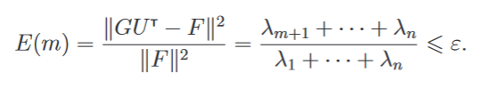

# Нелинейные методы восстановления регрессии

Общая идея в том, что задача сводится к решению последовательности более простых линейных задач.

 нелинейная модель регрессии.
Требуется минимизировать функционал качества по вектору параметров :

 .

### Метод Ньютона–Рафсона. 
Выберем начальное приближение и организуем итерационный процесс:

где  — градиент функционала Q в точке  

  — гессиан(матрица вторых производных) функционала Q в точке 

— величина шага,который можнорегулировать,а в простейшем варианте просто полагать равным единице.
  Запишем компоненты градиента:
  
  

Запишем компоненты гессиана:

### Основная сложность метода Ньютона–Рафсона заключается в обращении гессианана каждой итерации.

## Метод Ньютона-Гаусса

Если функция f достаточно гладкая(дважды непрерывно дифференцируема),то её можно линеаризовать в окрестности текущего значения вектора коэффициентов :

Заменим в гессиане функцию f на её линеаризацию.Это всё равно,что положить второе слагаемое в гессиане равным нулю.Тогда не нужно будет вычислять вторые производные. 

Основная сложность метода Ньютона–Рафсона заключается в обращении гессиана на каждой итерации.

Введём матричные обозначения: 

 — матрица первых производных.

 — вектор значений аппроксимирующей функции на t-й итерации

Тогда формула t-й итерации метода Ньютона–Гаусса в матричной записи примет вид:

