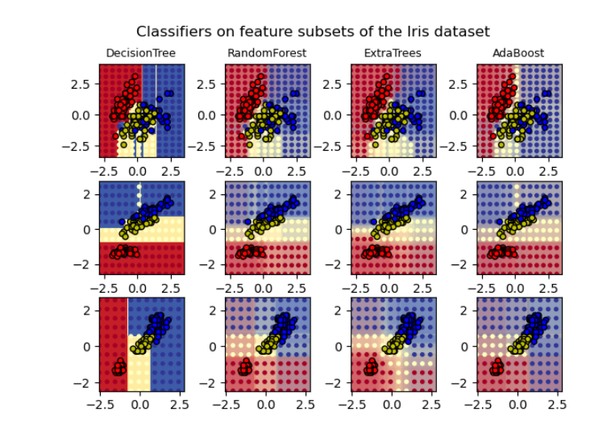

# AdaBoost
AdaBoost – это алгоритм усиления классификаторов.
Усиление – это ансамблевый алгоритм обучения, который берет множество алгоритмов обучения, например, деревья решений, и объединяет их. Целью является взять набор или группу слабых классификаторов и объединить их в один сильный.
Слабый классификатор производит классификацию с точностью чуть выше шанса. Популярный пример слабого классификатора – это так называемый «решающий пень» – одноуровневое дерево решений. 
Сильный классификатор, наоборот, имеет гораздо большую точность. Самым распространенным примером сильного классификатора является SVM.

Основной принцип AdaBoost состоит в том, чтобы подогнать последовательность слабых учеников (т. Е. Моделей, которые лишь немного лучше, чем случайное предположение, например, 
небольшие деревья решений) на повторно изменяемых версиях данных. Прогнозы от всех из них затем объединяются посредством взвешенного большинства голосов (или суммы) 
для получения окончательного прогноза. Модификации данных на каждой так называемой итерации повышения состоят в применении весов, к каждой из обучающих выборок. 
Первоначально все веса установлены по умолчанию, так что первый шаг просто обучает слабого ученика на исходных данных. Для каждой последующей итерации веса выборки изменяются
индивидуально, и алгоритм обучения повторно применяется к повторно взвешенным данным. На данном этапе те обучающие примеры, которые были неправильно предсказаны усиленной 
моделью, созданной на предыдущем шаге, имеют увеличенные веса, тогда как веса уменьшаются для тех, которые были предсказаны правильно. По мере продолжения итераций, примеры, 
которые трудно предсказать, получают все большее влияние. Таким образом, каждый последующий слабый ученик вынужден сконцентрироваться на примерах, которые упускают предыдущие в
последовательности.

Создание класса 
```py
class sklearn.ensemble.AdaBoostClassifier(base_estimator=None, *, n_estimators=50, learning_rate=1.0, algorithm='SAMME.R', random_state=None)
```
Параметры:
 - Базовая оценка, на основе которой строится усиленный ансамбль. Поддержка для образца взвешивания требуется, а также собственно classes_и n_classes_атрибуты. Если None, то базовая оценка равна DecisionTreeClassifier(max_depth=1).
 - n_estimators int, по умолчанию = 50 Максимальное количество оценщиков, при котором ускорение прекращается. В случае идеальной подгонки процедура обучения прекращается досрочно.
 - learning_rate float, по умолчанию = 1. Скорость обучения сокращает вклад каждого классификатора на learning_rate. Существует компромисс между learning_rateи n_estimators.
 - algorithm {'SAMME', 'SAMME.R'}, по умолчанию = 'SAMME.R' Если "SAMME.R", тогда используйте реальный алгоритм повышения SAMME.R. base_estimatorдолжен поддерживать расчет вероятностей класса. Если "SAMME", тогда используйте алгоритм дискретного повышения SAMME. Алгоритм SAMME.R обычно сходится быстрее, чем SAMME, обеспечивая меньшую ошибку теста с меньшим количеством итераций повышения.
 - random_state int или RandomState, по умолчанию = None Управляет случайным начальным значением, заданным base_estimatorна каждой итерации повышения. Таким образом, он используется только при base_estimatorвыставлении файла random_state. Передайте int для воспроизводимого вывода при нескольких вызовах функций. 

Методы класса:

 - decision_function(X) - Вычисляет решающую функцию X.
 - fit(X, y[, sample_weight]) - Создаёт усиленный классификатор из обучающего набора (X, y).
 - get_params([deep]) - Получить параметры для этого оценщика
 - predict(X) - Предсказать классы для X.
 - predict_log_proba(X) - Предсказать логарифмические вероятности класса для X.
 - predict_proba(X) - Предскажите вероятности классов для X.
 - score(X, y[, sample_weight]) - Возвращает среднюю точность для заданных тестовых данных и меток.
 - set_params(params) - Установите параметры этого оценщика.
 - staged_decision_function(X) - Вычислить функцию принятия решения X для каждой итерации повышения.
 - staged_predict(X) - 	Верните поэтапные прогнозы для X.
 - staged_predict_proba(X) - Предскажите вероятности классов для X.
 - staged_score(X, y[, sample_weight]) - Возвращает поэтапные оценки для X, y.
 
 # Примеры исполтзования Scikit-Learn
 
## Two-class AdaBoost

Этот пример соответствует решения AdaBoosted на нелинейно разделяемом наборе данных классификации, состоящем из двух кластеров «гауссовских квантилей», И отображает границу решения и оценки решения. Распределение оценок за решение показано отдельно для выборок класса A и B. Метка предсказанного класса для каждой выборки определяется знаком оценки решения. Выборки с оценкой решения больше нуля классифицируются как B, а в противном случае классифицируются как A. Величина оценки решения определяет степень сходства с предсказанной меткой класса. Кроме того, можно создать новый набор данных, содержащий желаемую чистоту класса B, например, путем отбора только образцов с оценкой решения выше некоторого значения.


[Реализация](labs/Two_class_AdaBoost.ipynb)

## Мультиклассовые деревья принятия решений AdaBoosted

Этот пример показывает, как усиление может улучшить точность прогнозирования для мультиклассовой задачи. Набор классификационных данных строится путем взятия десятимерного стандартного нормального распределения и определения трех классов, разделенных вложенными концентрическими десятимерными сферами, так что примерно равное количество выборок находится в каждом классе.

Сравнивается производительность алгоритмов SAMME и SAMME.R 1 . SAMME.R использует оценки вероятности для обновления аддитивной модели, в то время как SAMME использует только классификации. Как показывает пример, алгоритм SAMME.R обычно сходится быстрее, чем SAMME, обеспечивая меньшую ошибку теста с меньшим количеством итераций повышения. Ошибка каждого алгоритма в тестовом наборе после каждой итерации повышения показана слева, ошибка классификации на тестовом наборе каждого дерева показана в середине, а вес повышения каждого дерева показан справа. В алгоритме SAMME.R все деревья имеют вес, равный единице, и поэтому не отображаются.


[Реализация](labs/Multi_class_AdaBoosted_Decision_Trees.ipynb)

## Сравнение классификаторов

Сравнение нескольких классификаторов в scikit-learn на синтетических наборах данных. Цель этого примера - показать границы принятия решений различных классификаторов.
В многомерных пространствах данные могут быть более легко разделены линейно, а простота классификаторов, таких как наивный байесовский алгоритм и линейные SVM, 
может привести к лучшему обобщению, чем это достигается другими классификаторами. На графиках точки тренировки показаны сплошным цветом, а точки тестирования - 
полупрозрачными. В правом нижнем углу показана точность классификации на тестовой выборке.


[Реализация](labs/Classifier_comparison.ipynb)

## Дискретный против реального AdaBoost
Этот пример иллюстрирует разницу в производительности между дискретным алгоритмом повышения SAMME 2 и реальным алгоритмом повышения SAMME.R. Оба алгоритма оцениваются в задаче двоичной классификации, где цель Y является нелинейной функцией 10 входных характеристик. Дискретный SAMME AdaBoost адаптируется на основе ошибок в предсказанных метках классов, тогда как реальный SAMME.R использует предсказанные вероятности классов.


[Реализация](labs/Discretevs_Real_AdaBoost.ipynb)

## Построение решающих поверхностей ансамблей деревьев на наборе данных iris

Этот график сравнивает поверхности решений, полученные классификатором дерева решений (первый столбец), классификатором случайного леса (второй столбец), классификатором дополнительных деревьев (третий столбец) и классификатором AdaBoost (четвертый столбец).
В первом ряду классификаторы построены с использованием только характеристик ширины и длины чашелистиков, во втором ряду используются только длина лепестка и длина чашелистика, а в третьем ряду - только ширина лепестка и длина лепестка.
В порядке убывания качества при обучении (за пределами этого примера) всем 4 функциям с использованием 30 оценщиков и оценке с использованием 10-кратной перекрестной проверки мы видим:



[Реализация](labs/plot_forest_iris.ipynb)
