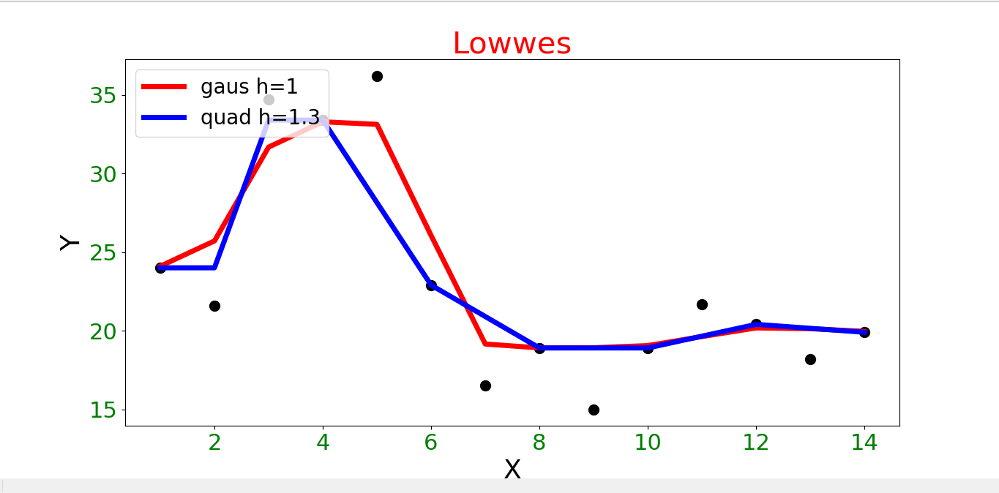

# ML практика

## Задача обучения по прецедентам (основная задача ТМО):

Пусть задано множество объектов *X* и множество допустимых ответов *Y*.
Существует целевая функция , значения которой 
) известны только на конечном подмножестве объектов 
&space;\}&space;\subset&space;X). Пары "объект-ответ" ) называются прецедентами. Совокупность пар ,&space;i&space;=&space;1,&space;...,&space;l) называется обучающей выборкой. 

Задача обучения по прецедентам заключается в том, чтобы по выборке  восстановить зависимость , т.е. построить решающую функцию 
, которая приближала бы целевую функцию 
), причём не только на объектах обучающей выборки, но и на всём множестве *X*.

# Методы восстановления регрессии

*Задачей восстановления регрессии* называется задача обучения по прецедентам при . Решающую функцию *a* называют *"функцией регрессии"*.

Пусть задана *модель регрессии* ,&space;\alpha&space;\in&space;\mathbb{R}^m), где  — вектор параметров модели. В качестве *функционала качества* используется сумма квадратов ошибок (SSE):


**Метод наименьших квадратов** (*МНК*) находит вектор параметров , при котором функционал качества минимальный. 


Суть МНК заключается в приравнивании к нулю производной от SSE по вектору параметров :

&space;=&space;2\sum_{i&space;=&space;1}^{l}(\phi(x_i,&space;\alpha)&space;-&space;y_i)\frac{\partial&space;\phi}{\partial&space;\alpha}(x_i,&space;\alpha)&space;=&space;0)

# Непараметрическая регрессия (ядерное сглаживание)

*Непараметрическое восстановление регрессии* основано на той же идее, что и непараметрическое восстановление плотности распределения: значение 
) вычисляется для каждого объекта  по 
нескольким ближайшим к нему объектам обучающей выборки. Близость объектов определяется согласно функции расстояния 
), заданной на множестве объектов .
Смыслом задачи регрессии является восстановление зависимости между объектами, и соответствующими им ответами.
В парамерическом подходе считается, что зависимость имеет чётко заданную функциональную форму (например, прямой) и описывается конечным набором параметров.
В непараметрическом подходе функция регрессии полагается неизвестной, и восстанавливается в каждой точке локально, в пределах некоторого окна. 

## Формула Надарая-Ватсона

Рассматривается самая простая модель регрессии &space;=&space;\alpha,&space;\alpha&space;\in&space;R) 
(*константа*). При этом, чтобы не получить тривиального решения, каждому объекту выборки  назначаются *веса* 
согласно весовой функции ). Они зависят, соответственно, от объекта , 
в котором вычисляется значение &space;=&space;\phi(x,&space;\alpha)). 

Веса задаются таким образом, чтобы они убывали по мере увелечения расстояния от рассматриваемых объектов выборки до . 
Для этого вводится невозрастающая, гладкая и ограниченная *функция ядра* :

&space;=&space;K\left&space;(&space;\frac{\rho(x,&space;x_i)}{h}&space;\right&space;)), где 
 — ширина окна сглаживания. Чем меньше , 
тем быстрее убывают веса ) по мере удаления  от .

Можно сказать, что обучение регрессионной модели будет производиться отдельно в каждой точке . 
Для того, чтобы вычислить оптимальное  необходимо воспользоваться *МНК*:

&space;=&space;\sum_{i&space;=&space;1}^{l}w_i(x)(\alpha&space;-&space;y_i)^2&space;\rightarrow&space;\min&space;\limits_{\alpha&space;\in&space;\mathbb{R}})

После приравнивания к нулю производной , 
получается **формула ядерного сглаживания Надарая-Ватсона**:

&space;=&space;\frac{\sum\limits_{i&space;=&space;1}^{l}y_i&space;w_i(x)}{\sum\limits_{i&space;=&space;1}^{l}&space;w_i(x)})

Оптимальное  подбирается по скользящему контролю *LOO* следующим образом:

&space;=&space;\sum_{i&space;=&space;1}^{l}(a_h(x_i,&space;(\{&space;X^l&space;\backslash&space;x_i)\})&space;-&space;y_i)^2&space;\rightarrow&space;\min\limits_h)


В качестве ядер в реализации использовались квартическое и гауссовское:

&space;=&space;(1&space;-&space;x^2)^2[|x|&space;\leq&space;1])

&space;=&space;\frac{1}{\sqrt{2\pi}}\exp(\frac{-x^2}{2}))

```py
# Гауссовское ядро
def gaus(r):
    return (2 * math.pi) ** -0.5 * math.exp(-0.5 * r ** 2)

# Квадратическое ядро
def quad(r):
  if (abs(r) <= 1):
    return (1-r**2)**2
  else:
    return 0
```
### Реализация формулы Nadatay Watson

```py
def nadaray_watson(x, y, func, h):
    n = len(x)
    w = []
    for t in range(n):
        w.append([])
        for i in range(n):
            #print(distance.euclidean(x[t], x[i]))
            w[t].append(func(distance.euclidean(x[t], x[i]) / h))
    w = np.array(w)
    print(w)
    y_nadaray = (w * y[:, None]).sum(axis=0) / w.sum(axis=0)
    return y_nadaray

```

### Пример работы алгоритм


### LOWESS — локально взвешенное сглаживание

Оценка Надарая-Ватсона чувствительна к большим одиночным выбросам. Для нахождения выбросов вычисляется *величина ошибки* &space;\})-y_i|). Чем она больше, тем в большей степени прецедент ) является выбросом. Следовательно, таким прецедентам нужно понизить вес.

Отсюда возникла идея домножить веса  на следующие коэффициенты:

&space;=&space;\widetilde{K}(|a_i&space;-&space;y_i|)),

где  — ещё одно ядро, вообще говоря, отличное от .

Ниже представлен алгоритм нахождения коэффициентов :

1. 
2. **повторять пока**  не стабилизируются:
- вычислить *LOO* на каждом объекте: 

&space;=&space;\frac{\sum\limits_{j&space;=&space;1,&space;j&space;\neq&space;i}^{l}&space;y_j&space;\gamma_j&space;K(\frac{\rho(x_i,&space;x_j)}{h})}{\sum\limits_{j&space;=&space;1,&space;j&space;\neq&space;i}^{l}&space;\gamma_j&space;K(\frac{\rho&space;(x_i,&space;x_j)}{h})};)

- вычислить коэффициенты :

.)

Будем считать, что коэффициенты *стабилизированы*, когда для соседних  разность *LOO* станет меньше некоторого заданного значения.

Ядро ) задаётся следующим образом:

&space;=&space;K_Q\left&space;(&space;\frac{\varepsilon}{6med\left&space;(&space;\varepsilon_i&space;\right&space;)}&space;\right&space;),)

где  — квартическое ядро, ) — медиана вариационного ряда ошибок.

Реализация алгоирма Lowwes

```py
def lowess(x, y, func, h):
    n = len(x)
    gamma = np.ones(n)
    gamma_old = np.zeros(n)
    while np.abs(sum(gamma) - sum(gamma_old))>=eps:
        w = []
        for t in range(n):
            w.append([])
            for i in range(n):
                w[t].append(func(distance.euclidean(x[t], x[i]) / h)*gamma[t])
        w = np.array(w)
        y_lowess = (w * y[:, None]).sum(axis=0) / w.sum(axis=0)
        err = np.abs(y_lowess - y)
        gamma_old = gamma[:]
        gamma = [quad(err[j]) for j in range(n)]
    return y_lowess
```

### Пример работы алгоритма



## Сравнение Nadaray Watson vs Lowwes


Lowwes менее чувствительнее к выбросам.
